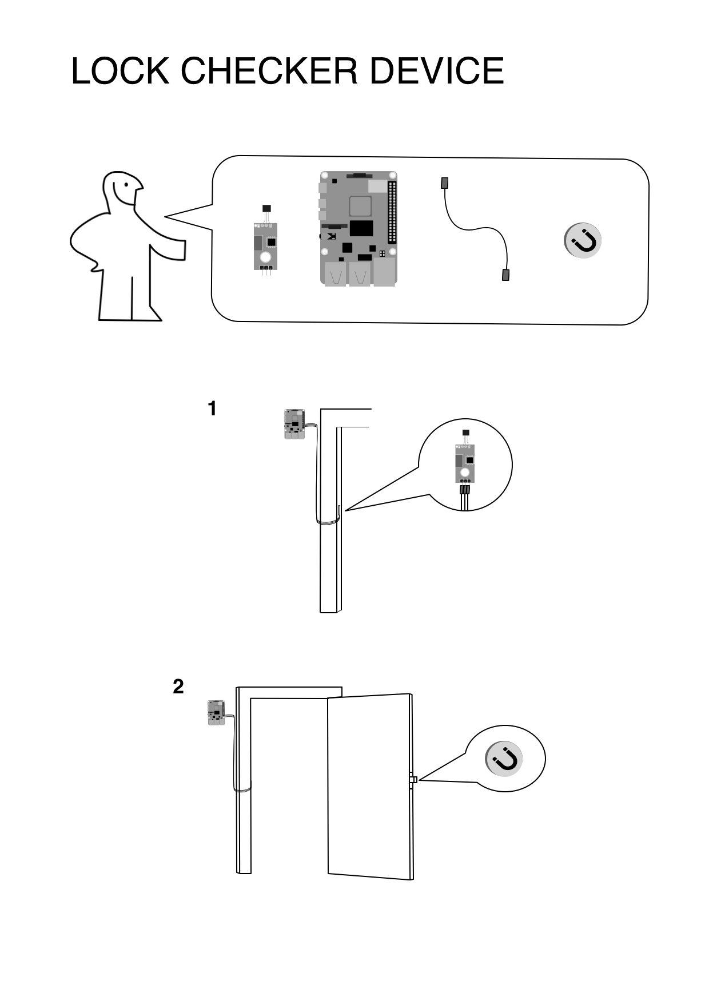

# README

Build a device that will check whether your door is locked, using a Raspberry PI, a hall effect sensor and a small but strong (preferably neodymium) magnet. It will store the results in a cloud database of your choice (this specific one uses AWS DynamoDB ). The results can be displayed by a separate web application using the same database. You can find an example for the web application [here](https://github.com/menyhertfatyol/my-front-door).
## Prerequisites

To set up your development environment, you'll need to following:

- [Docker](https://www.docker.com/)
- A Ruby version manager ([RVM](https://rvm.io/) or [Rbenv](https://github.com/sstephenson/rbenv) preferred)
- The appropriate version of Ruby, along with the Bundler gem

This script leverages the pigpio daemon to communicate with the sensor. Make sure `pigpiod` is installed on your Raspberry PI and it is enabled by `systemd`.

## Setting up

Install the necessary gems:
```bash
bundle install
```

By default this script will use the broadcom number 17 pin as the input pin.

## Running the tests
*The build will only run on a Raspberry PI!*

Start up Docker Compose:
```bash
docker compose up
```

To run the tests from the project root:
```bash
bundle exec rspec spec/door_spec.rb
```

## Production setup

If you also willing to go for AWS DynamoDB for the database, set the following env variables to be able to connect to your DB instance
```bash
ENV['STATUS_STORE_URL']
ENV['AWS_ACCESS_KEY_ID']
ENV['AWS_ACCESS_KEY']
```

Run `ruby ./check_lock.rb` to execute the script once or schedule a cronjob to run it every minute:

```bash
* * * * * bash -lc "cd /path/to/project/lock-checker-script/ && ruby ./check_lock.rb" > ~/cron.log 2>&1
```
